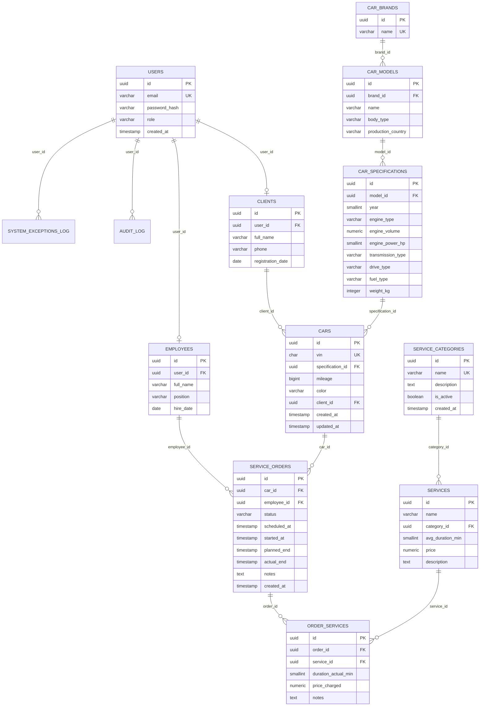

# Автосервис API

## Введение
Данный проект был сделан в качестве курсового проекта по предмету "Базы данных". Основная идея - продемонстрировать умение проектировать, создавать и работать с таблицами в базе данных PostgreSQL.

В качестве дополнительного бонуса был написан REST API на Java с использованием фреймворка Spring, а также ORM Hibernate.

Предметная область проекта - работа автосервиса: учет клиентов, сотрудников, автомобилей, услуг и заказов на обслуживание. Такая система позволяет хранить данные о машинах клиентов, фиксировать обращения в сервис, назначать ответственных сотрудников, отслеживать статус выполнения работ и формировать отчеты по автомобилям и популярности услуг.

Цель проекта - спроектировать базу данных для автосервиса и показать ее использование в прикладном backend-приложении. В рамках проекта реализованы:

- структура таблиц с первичными и внешними ключами;
- ограничения целостности для статусов, ролей, VIN, цен и технических характеристик автомобилей;
- связи между пользователями, клиентами, сотрудниками, автомобилями, заказами и услугами;
- представления для отчетов и агрегированной статистики;
- триггеры для аудита изменений и автоматического обновления даты изменения автомобиля;
- REST API для работы с основными сущностями системы.

Проект можно рассматривать как небольшой прототип информационной системы автосервиса, где база данных является центральной частью приложения, а API предоставляет удобный способ работы с ней.

## Структура базы данных

Данные конкретного автомобиля и справочные характеристики разделены:

- `cars` хранит экземпляр автомобиля: VIN, пробег, цвет, клиента и ссылку на спецификацию.
- `car_brands` хранит марки автомобилей.
- `car_models` хранит модели, тип кузова и страну производства.
- `car_specifications` хранит техническую спецификацию: год, двигатель, трансмиссию, привод, тип топлива и массу.

При добавлении автомобиля через API можно передавать поля `brand`, `model`, `year`, `engineType` и т.д.; сервис автоматически создаст или найдет записи в справочных таблицах и сохранит в `cars` только ссылку `specification_id`.

### Основные таблицы

`users` - учетные записи пользователей. Поле `role` ограничено значениями `client` и `employee`.

`clients` - профили клиентов. Каждая запись связана с одним пользователем через `user_id`; при удалении пользователя клиент удаляется каскадно.

`employees` - профили сотрудников. Каждая запись также связана с одним пользователем через `user_id`.

`service_categories` - категории услуг автосервиса: название, описание, признак активности.

`services` - конкретные услуги. Каждая услуга относится к категории через `category_id`, содержит среднюю длительность и базовую цену.

`car_brands` - справочник марок автомобилей. Название марки уникально.

`car_models` - справочник моделей. Модель связана с маркой через `brand_id`; пара `brand_id + name` уникальна. Здесь же хранится тип кузова и страна производства.

`car_specifications` - справочник технических спецификаций модели: год, тип двигателя, объем, мощность, трансмиссия, привод, тип топлива и масса. Уникальность задается набором характеристик, чтобы одинаковая спецификация не дублировалась.

`cars` - конкретные автомобили клиентов. Таблица хранит VIN, пробег, цвет, владельца `client_id` и ссылку на техническую спецификацию `specification_id`.

`service_orders` - заказы на обслуживание. Заказ связан с автомобилем через `car_id`, опционально с сотрудником через `employee_id`, а также хранит статус и даты выполнения.

`order_services` - состав заказа. Связывает заказ с услугами, хранит фактическую длительность, цену в заказе и заметки. Пара `order_id + service_id` уникальна.

`audit_log` - журнал аудита изменений в ключевых таблицах.

`system_exceptions_log` - журнал системных ошибок и необработанных исключений.

### Представления

`service_stats_view` агрегирует статистику по услугам: количество использований, среднюю фактическую длительность и суммарную выручку.

`car_orders_view` собирает данные автомобиля, клиента и заказов в одну проекцию для отчетов и быстрых выборок.

### Триггеры

`trigger_cars_updated_at` обновляет поле `cars.updated_at` перед изменением автомобиля.

`audit_cars_trigger`, `audit_service_orders_trigger`, `audit_users_trigger` пишут изменения в `audit_log`.

### Граф связей



## Аутентификация
Используется HTTP Basic Authentication:
- Клиент: `client@test.com` / `password`
- Сотрудник: `employee@test.com` / `password`

## Endpoints

### Автомобили

#### GET /api/v1/cars
Получить все автомобили (только для сотрудников)

#### GET /api/v1/cars/my
Получить автомобили текущего клиента

#### GET /api/v1/cars/vin/{vin}
Получить автомобиль по VIN номеру
- Клиенты видят только свои автомобили
- Сотрудники видят все

#### POST /api/v1/cars
Добавить новый автомобиль (только для сотрудников)

```json
{
  "vin": "WVWZZZ1KZ6W123456",
  "brand": "Volkswagen",
  "model": "Passat",
  "year": 2020,
  "engineType": "gasoline",
  "engineVolume": 2.0,
  "enginePowerHp": 150,
  "transmissionType": "automatic",
  "driveType": "FWD",
  "fuelType": "AI_95",
  "bodyType": "седан",
  "productionCountry": "Германия",
  "weightKg": 1500,
  "mileage": 50000,
  "color": "черный"
}
```

При сохранении эти данные распределяются по таблицам `car_brands`, `car_models`, `car_specifications` и `cars`.

### Заказы на обслуживание

#### GET /api/v1/orders
Получить все заказы (только для сотрудников)

#### GET /api/v1/orders/my
Получить заказы текущего клиента

#### GET /api/v1/orders/car/{vin}
Получить заказы по VIN автомобиля

#### POST /api/v1/orders
Создать новый заказ

#### PATCH /api/v1/orders/{id}/status?status={status}
Обновить статус заказа (только для сотрудников)
Статусы: `scheduled`, `in_progress`, `completed`, `cancelled`

### Категории услуг

#### GET /api/v1/categories
Получить активные категории услуг (доступно всем)

### Отчеты

#### GET /api/v1/reports/cars
Отчет по автомобилям (только для сотрудников)

#### GET /api/v1/reports/services/popularity
Отчет по популярности услуг (только для сотрудников)

### Батчевая загрузка

#### POST /api/v1/batch/cars/csv
Загрузка автомобилей из CSV файла (только для сотрудников)

#### POST /api/v1/batch/cars/json
Загрузка автомобилей из JSON файла (только для сотрудников)

### Журнал ошибок

#### GET /api/v1/exceptions
Получить все исключения (только для сотрудников)

#### GET /api/v1/exceptions/unhandled
Получить необработанные исключения (только для сотрудников)

#### PATCH /api/v1/exceptions/{id}/handle
Отметить исключение как обработанное (только для сотрудников)

## Функциональность

### Для клиентов:
- Просмотр своих автомобилей по VIN
- Просмотр истории заказов
- Создание новых заказов
- Просмотр статуса и планового времени окончания работ

### Для сотрудников:
- Просмотр всех автомобилей и заказов
- Добавление автомобилей в базу
- Управление статусами заказов
- Формирование отчетов
- Батчевая загрузка данных
- Мониторинг ошибок системы

## Запуск
```bash
mvn spring-boot:run
```

База данных PostgreSQL должна быть запущена на localhost:5432 с именем `kpautoservice`.
